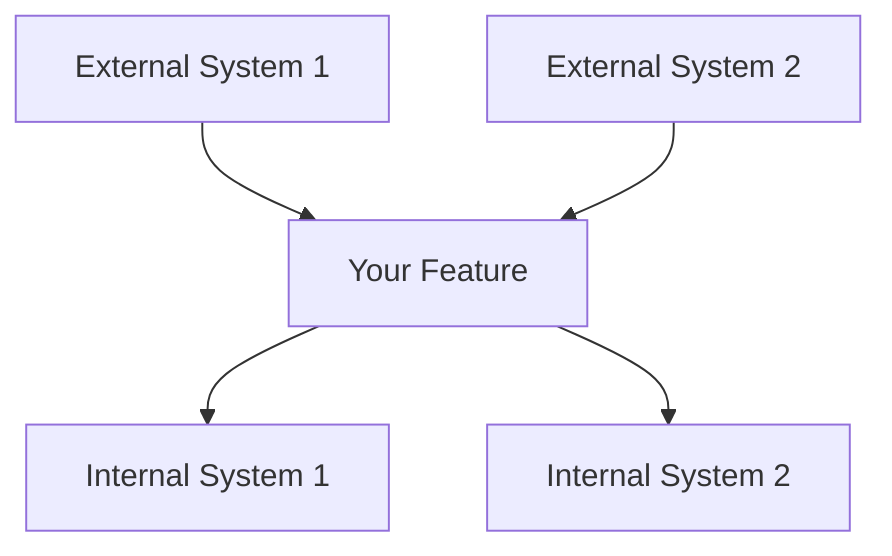
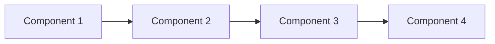
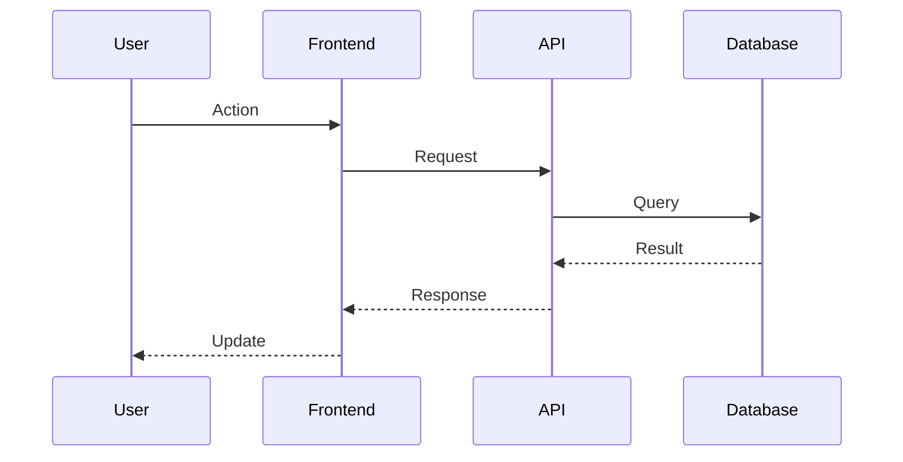

```
# Requirements Template

<!-- Navigation Metadata -->
<!-- Template: Requirements | Level: Template | Prerequisites: None -->
<!-- Related: process/requirements-phase.md, resources/standards.md, examples/simple-feature-spec.md -->

**📍 You are here:** [Main Guide](../../README.md) → [Templates](README.md) → **Requirements Template**

## Quick Navigation
- **📚 Learn Process:** [Requirements Phase Guide](../process/requirements-phase.md) - How to use this template
- **📖 See Example:** [Simple Feature Requirements](../examples/simple-feature-spec.md#requirements-document) - Template in action
- **📋 EARS Reference:** [Standards Guide](../resources/standards.md) - EARS format details
- **➡️ Next Template:** [Design Template](design-template.md) - After requirements are done

---

Use this template to create comprehensive requirements documents using the EARS (Easy Approach to Requirements Syntax) format.

## Document Information

- **Feature Name**: [Your Feature Name]
- **Version**: 1.0
- **Date**: [Current Date]
- **Author**: [Your Name]
- **Stakeholders**: [List key stakeholders]

## Introduction

[Provide a clear, concise overview of the feature. Explain what problem it solves and why it's needed. Keep this section to 2-3 paragraphs maximum.]

### Feature Summary
[One sentence summary of what this feature does]

### Business Value
[Explain the business value and expected outcomes]

### Scope
[Define what is included and excluded from this feature]

## Requirements

### Requirement 1: [Requirement Title]

**User Story:** As a [role/user type], I want [desired functionality], so that [benefit/value].

#### Acceptance Criteria

1. WHEN [specific event or trigger] THEN [system name] SHALL [specific system response]
2. IF [condition or state] THEN [system name] SHALL [required behavior]
3. WHILE [ongoing condition] [system name] SHALL [continuous behavior]
4. WHERE [context or location] [system name] SHALL [contextual behavior]

#### Additional Details
- **Priority**: [High/Medium/Low]
- **Complexity**: [High/Medium/Low]
- **Dependencies**: [List any dependencies on other requirements or systems]
- **Assumptions**: [List any assumptions made]

### Requirement 2: [Requirement Title]

**User Story:** As a [role/user type], I want [desired functionality], so that [benefit/value].

#### Acceptance Criteria

1. WHEN [specific event or trigger] THEN [system name] SHALL [specific system response]
2. IF [condition or state] THEN [system name] SHALL [required behavior]

#### Additional Details
- **Priority**: [High/Medium/Low]
- **Complexity**: [High/Medium/Low]
- **Dependencies**: [List any dependencies]
- **Assumptions**: [List any assumptions]

### Requirement 3: [Requirement Title]

**User Story:** As a [role/user type], I want [desired functionality], so that [benefit/value].

#### Acceptance Criteria

1. WHEN [specific event or trigger] THEN [system name] SHALL [specific system response]
2. IF [condition or state] THEN [system name] SHALL [required behavior]

#### Additional Details
- **Priority**: [High/Medium/Low]
- **Complexity**: [High/Medium/Low]
- **Dependencies**: [List any dependencies]
- **Assumptions**: [List any assumptions]

## Non-Functional Requirements

### Performance Requirements
- WHEN [load condition] THEN [system name] SHALL [performance criteria]
- IF [usage scenario] THEN [system name] SHALL [response time requirement]

### Security Requirements
- WHEN [security event] THEN [system name] SHALL [security response]
- IF [authentication condition] THEN [system name] SHALL [access control behavior]

### Usability Requirements
- WHEN [user interaction] THEN [system name] SHALL [usability standard]
- IF [accessibility condition] THEN [system name] SHALL [accessibility compliance]

### Reliability Requirements
- WHEN [failure condition] THEN [system name] SHALL [recovery behavior]
- IF [error state] THEN [system name] SHALL [error handling response]

## Constraints and Assumptions

### Technical Constraints
- [List technical limitations or constraints]
- [Include platform, technology, or integration constraints]

### Business Constraints
- [List business rules or policy constraints]
- [Include budget, timeline, or resource constraints]

### Assumptions
- [List assumptions about user behavior]
- [Include assumptions about system environment]
- [Note assumptions about external dependencies]

## Success Criteria

### Definition of Done
- [ ] All acceptance criteria are met
- [ ] Non-functional requirements are satisfied
- [ ] Integration requirements are fulfilled
- [ ] Testing criteria are passed

### Acceptance Metrics
- [Define measurable success criteria]
- [Include performance benchmarks]
- [Specify quality gates]

## Glossary

| Term | Definition |
|------|------------|
| [Term 1] | [Clear definition] |
| [Term 2] | [Clear definition] |
| [Term 3] | [Clear definition] |

---

## Requirements Review Checklist

Use this checklist to validate your requirements document:

### Completeness
- [ ] All user stories have clear roles, features, and benefits
- [ ] Each requirement has specific acceptance criteria using EARS format
- [ ] Non-functional requirements are addressed
- [ ] Success criteria are defined and measurable

### Quality
- [ ] Requirements are written in active voice
- [ ] Each acceptance criterion is testable
- [ ] Requirements avoid implementation details
- [ ] Terminology is consistent throughout

### EARS Format Validation
- [ ] WHEN statements describe specific events or triggers
- [ ] IF statements describe clear conditions or states
- [ ] WHILE statements describe continuous behaviors
- [ ] WHERE statements describe specific contexts
- [ ] All statements use SHALL for system responses

### Clarity
- [ ] Requirements are unambiguous
- [ ] Technical jargon is explained in glossary
- [ ] Stakeholders can understand all requirements
- [ ] No conflicting requirements exist

### Traceability
- [ ] Requirements are numbered and organized
- [ ] Dependencies between requirements are clear
- [ ] Requirements link to business objectives
- [ ] Assumptions and constraints are documented

---

## Tips for Writing Good Requirements

### Do's
- ✅ Use active voice and specific language
- ✅ Focus on what the system should do, not how
- ✅ Make each requirement testable and verifiable
- ✅ Include both positive and negative scenarios
- ✅ Consider edge cases and error conditions

### Don'ts
- ❌ Don't use vague terms like "user-friendly" or "fast"
- ❌ Don't combine multiple requirements in one statement
- ❌ Don't specify implementation details
- ❌ Don't use subjective or unmeasurable criteria
- ❌ Don't forget to consider non-functional aspects

### Common EARS Patterns

**Event-Driven (WHEN)**
- User actions: "WHEN user clicks submit button"
- System events: "WHEN data sync completes"
- Time-based: "WHEN daily backup runs"

**Condition-Based (IF)**
- State checks: "IF user is authenticated"
- Data validation: "IF input is invalid"
- Permission checks: "IF user has admin role"

**Continuous (WHILE)**
- Ongoing processes: "WHILE file is uploading"
- Monitoring: "WHILE system is running"
- Real-time updates: "WHILE user is typing"

**Contextual (WHERE)**
- Platform-specific: "WHERE application runs on mobile"
- Environment-specific: "WHERE system is in production"
- Location-specific: "WHERE user is in restricted area"

---

[← Back to Templates](README.md) | [Design Template →](design-template.md)
```


```
# Tasks Template

<!-- Navigation Metadata -->
<!-- Template: Tasks | Level: Template | Prerequisites: design-template.md -->
<!-- Related: process/tasks-phase.md, execution/implementation-guide.md, examples/simple-feature-spec.md -->

**📍 You are here:** [Main Guide](../../README.md) → [Templates](README.md) → **Tasks Template**

## Quick Navigation
- **📚 Learn Process:** [Tasks Phase Guide](../process/tasks-phase.md) - How to use this template
- **📖 See Example:** [Simple Feature Tasks](../examples/simple-feature-spec.md#tasks-document) - Template in action
- **⚡ Execute Tasks:** [Implementation Guide](../execution/implementation-guide.md) - How to work through tasks
- **🔄 Start Over:** [Requirements Template](requirements-template.md) - Full workflow

---

Use this template to create actionable implementation plans that break down your design into manageable coding tasks.

## Document Information

- **Feature Name**: [Your Feature Name]
- **Version**: 1.0
- **Date**: [Current Date]
- **Author**: [Your Name]
- **Related Documents**: 
  - Requirements: [Link to requirements document]
  - Design: [Link to design document]

## Implementation Overview

[Provide a brief summary of the implementation approach. Explain the overall strategy for building this feature and any key considerations for the development process.]

### Implementation Strategy
- [Key strategy point 1]
- [Key strategy point 2]
- [Key strategy point 3]

### Development Approach
- **Testing Strategy**: [TDD, BDD, or other approach]
- **Integration Strategy**: [How components will be integrated]
- **Deployment Strategy**: [How features will be deployed]

## Implementation Plan

### Phase 1: Foundation and Setup

- [ ] 1. Set up project structure and development environment
  - Create directory structure for the feature
  - Set up build configuration and dependencies
  - Configure development tools and linting
  - _Requirements: [Reference specific requirements]_

- [ ] 2. Implement core data models and interfaces
  - Define TypeScript interfaces for all data models
  - Implement validation functions for data integrity
  - Create unit tests for data model validation
  - _Requirements: [Reference specific requirements]_

- [ ] 3. Set up database schema and migrations
  - Create database tables and relationships
  - Write migration scripts for schema changes
  - Set up database connection and configuration
  - _Requirements: [Reference specific requirements]_

### Phase 2: Core Business Logic

- [ ] 4. Implement core business logic components
- [ ] 4.1 Create [Component Name] service
  - Implement core business rules and validation
  - Add error handling and logging
  - Write comprehensive unit tests
  - _Requirements: [Reference specific requirements]_

- [ ] 4.2 Create [Component Name] repository
  - Implement data access layer with CRUD operations
  - Add query optimization and caching
  - Write integration tests with database
  - _Requirements: [Reference specific requirements]_

- [ ] 4.3 Implement [Business Process] workflow
  - Code the main business process flow
  - Add state management and transitions
  - Write unit tests for workflow logic
  - _Requirements: [Reference specific requirements]_

### Phase 3: API Layer

- [ ] 5. Implement REST API endpoints
- [ ] 5.1 Create [Resource] API endpoints
  - Implement GET, POST, PUT, DELETE operations
  - Add request validation and sanitization
  - Write API integration tests
  - _Requirements: [Reference specific requirements]_

- [ ] 5.2 Add authentication and authorization
  - Implement JWT token validation
  - Add role-based access control
  - Write security tests and validation
  - _Requirements: [Reference specific requirements]_

- [ ] 5.3 Implement error handling and logging
  - Create consistent error response format
  - Add comprehensive logging and monitoring
  - Write error handling tests
  - _Requirements: [Reference specific requirements]_

### Phase 4: User Interface

- [ ] 6. Implement user interface components
- [ ] 6.1 Create [UI Component] components
  - Build reusable UI components
  - Add responsive design and accessibility
  - Write component unit tests
  - _Requirements: [Reference specific requirements]_

- [ ] 6.2 Implement [Feature] user flows
  - Create complete user interaction flows
  - Add form validation and error handling
  - Write end-to-end tests for user scenarios
  - _Requirements: [Reference specific requirements]_

- [ ] 6.3 Add state management and data fetching
  - Implement client-side state management
  - Add API integration and caching
  - Write integration tests for data flow
  - _Requirements: [Reference specific requirements]_

### Phase 5: Integration and Testing

- [ ] 7. Implement system integration
- [ ] 7.1 Integrate with external services
  - Implement external API integrations
  - Add retry logic and error handling
  - Write integration tests with mocked services
  - _Requirements: [Reference specific requirements]_

- [ ] 7.2 Add monitoring and observability
  - Implement health checks and metrics
  - Add performance monitoring and alerting
  - Write monitoring validation tests
  - _Requirements: [Reference specific requirements]_

- [ ] 7.3 Implement comprehensive testing suite
  - Create end-to-end test scenarios
  - Add performance and load testing
  - Write security and penetration tests
  - _Requirements: [Reference specific requirements]_

### Phase 6: Deployment and Documentation

- [ ] 8. Prepare for deployment
- [ ] 8.1 Create deployment configuration
  - Write deployment scripts and configuration
  - Set up environment-specific settings
  - Create rollback procedures
  - _Requirements: [Reference specific requirements]_

- [ ] 8.2 Create operational documentation
  - Write API documentation and examples
  - Create troubleshooting guides
  - Document configuration and maintenance procedures
  - _Requirements: [Reference specific requirements]_

- [ ] 8.3 Implement final validation and cleanup
  - Run complete test suite and validation
  - Perform code review and quality checks
  - Clean up temporary code and comments
  - _Requirements: [Reference specific requirements]_

---

## Task Planning Guidelines

### Task Structure Best Practices

#### Task Naming
- Use action verbs (Implement, Create, Add, Build)
- Be specific about what's being built
- Include the component or feature name
- Keep titles concise but descriptive

#### Task Details
- **Scope**: Clearly define what's included/excluded
- **Acceptance Criteria**: Specific, testable outcomes
- **Dependencies**: Prerequisites and blockers
- **Estimates**: Time or complexity estimates

#### Sub-task Organization
- Break large tasks into smaller, manageable pieces
- Each sub-task should be completable in 1-2 days
- Maintain logical sequence and dependencies
- Ensure each sub-task has clear deliverables

### Requirements Traceability

Each task should reference specific requirements:
- Use requirement numbers or identifiers
- Link to acceptance criteria being addressed
- Ensure all requirements are covered by tasks
- Validate task completion against requirements

### Testing Integration

Every implementation task should include testing:
- **Unit Tests**: For individual components and functions
- **Integration Tests**: For component interactions
- **End-to-End Tests**: For complete user scenarios
- **Performance Tests**: For non-functional requirements

---

## Task Execution Checklist

Use this checklist when executing each task:

### Before Starting
- [ ] Requirements and design documents are reviewed
- [ ] Dependencies are identified and available
- [ ] Development environment is set up
- [ ] Task scope and acceptance criteria are clear

### During Implementation
- [ ] Code follows established patterns and standards
- [ ] Unit tests are written alongside implementation
- [ ] Error handling and edge cases are considered
- [ ] Code is documented with clear comments

### Before Completion
- [ ] All acceptance criteria are met
- [ ] Tests pass and coverage is adequate
- [ ] Code review is completed
- [ ] Integration with existing code is verified

### Task Completion
- [ ] Feature works as specified in requirements
- [ ] No regressions in existing functionality
- [ ] Documentation is updated if needed
- [ ] Task is marked as complete in tracking system

---

## Common Task Patterns

### Data Layer Tasks
```markdown
- [ ] X. Implement [Entity] data model
  - Create TypeScript interface with validation
  - Implement database schema and migrations
  - Add CRUD operations with error handling
  - Write unit and integration tests
  - _Requirements: [X.X]_
```

### Service Layer Tasks
```markdown
- [ ] X. Create [Service] business logic
  - Implement core business rules and validation
  - Add error handling and logging
  - Create service interfaces and abstractions
  - Write comprehensive unit tests
  - _Requirements: [X.X]_
```

### API Layer Tasks
```markdown
- [ ] X. Implement [Resource] API endpoints
  - Create REST endpoints with proper HTTP methods
  - Add request/response validation
  - Implement authentication and authorization
  - Write API integration tests
  - _Requirements: [X.X]_
```

### UI Layer Tasks
```markdown
- [ ] X. Build [Component] user interface
  - Create reusable UI components
  - Implement responsive design
  - Add accessibility features
  - Write component tests and user scenarios
  - _Requirements: [X.X]_
```

### Integration Tasks
```markdown
- [ ] X. Integrate with [External System]
  - Implement API client with error handling
  - Add retry logic and circuit breakers
  - Create integration tests with mocking
  - Document integration procedures
  - _Requirements: [X.X]_
```

---

## Estimation Guidelines

### Task Sizing
- **Small (1-2 days)**: Simple components, basic CRUD operations
- **Medium (3-5 days)**: Complex business logic, API integrations
- **Large (1-2 weeks)**: Major features, complex UI flows

### Complexity Factors
- **Technical Complexity**: New technologies, complex algorithms
- **Integration Complexity**: Multiple system interactions
- **Business Complexity**: Complex rules, edge cases
- **Testing Complexity**: Extensive test scenarios

### Risk Assessment
- **High Risk**: New technologies, external dependencies
- **Medium Risk**: Complex business logic, performance requirements
- **Low Risk**: Standard CRUD operations, familiar patterns

---

## Quality Gates

### Code Quality
- [ ] Code follows team standards and conventions
- [ ] No code smells or technical debt introduced
- [ ] Proper error handling and logging implemented
- [ ] Security best practices followed

### Testing Quality
- [ ] Unit test coverage meets minimum threshold
- [ ] Integration tests cover key scenarios
- [ ] End-to-end tests validate user workflows
- [ ] Performance tests meet requirements

### Documentation Quality
- [ ] Code is self-documenting with clear naming
- [ ] Complex logic is explained with comments
- [ ] API changes are documented
- [ ] README and setup instructions are updated

---

[← Design Template](design-template.md) | [Back to Templates](README.md)
```

```
# Tasks Template

<!-- Navigation Metadata -->
<!-- Template: Tasks | Level: Template | Prerequisites: design-template.md -->
<!-- Related: process/tasks-phase.md, execution/implementation-guide.md, examples/simple-feature-spec.md -->

**📍 You are here:** [Main Guide](../../README.md) → [Templates](README.md) → **Tasks Template**

## Quick Navigation
- **📚 Learn Process:** [Tasks Phase Guide](../process/tasks-phase.md) - How to use this template
- **📖 See Example:** [Simple Feature Tasks](../examples/simple-feature-spec.md#tasks-document) - Template in action
- **⚡ Execute Tasks:** [Implementation Guide](../execution/implementation-guide.md) - How to work through tasks
- **🔄 Start Over:** [Requirements Template](requirements-template.md) - Full workflow

---

Use this template to create actionable implementation plans that break down your design into manageable coding tasks.

## Document Information

- **Feature Name**: [Your Feature Name]
- **Version**: 1.0
- **Date**: [Current Date]
- **Author**: [Your Name]
- **Related Documents**: 
  - Requirements: [Link to requirements document]
  - Design: [Link to design document]

## Implementation Overview

[Provide a brief summary of the implementation approach. Explain the overall strategy for building this feature and any key considerations for the development process.]

### Implementation Strategy
- [Key strategy point 1]
- [Key strategy point 2]
- [Key strategy point 3]

### Development Approach
- **Testing Strategy**: [TDD, BDD, or other approach]
- **Integration Strategy**: [How components will be integrated]
- **Deployment Strategy**: [How features will be deployed]

## Implementation Plan

### Phase 1: Foundation and Setup

- [ ] 1. Set up project structure and development environment
  - Create directory structure for the feature
  - Set up build configuration and dependencies
  - Configure development tools and linting
  - _Requirements: [Reference specific requirements]_

- [ ] 2. Implement core data models and interfaces
  - Define TypeScript interfaces for all data models
  - Implement validation functions for data integrity
  - Create unit tests for data model validation
  - _Requirements: [Reference specific requirements]_

- [ ] 3. Set up database schema and migrations
  - Create database tables and relationships
  - Write migration scripts for schema changes
  - Set up database connection and configuration
  - _Requirements: [Reference specific requirements]_

### Phase 2: Core Business Logic

- [ ] 4. Implement core business logic components
- [ ] 4.1 Create [Component Name] service
  - Implement core business rules and validation
  - Add error handling and logging
  - Write comprehensive unit tests
  - _Requirements: [Reference specific requirements]_

- [ ] 4.2 Create [Component Name] repository
  - Implement data access layer with CRUD operations
  - Add query optimization and caching
  - Write integration tests with database
  - _Requirements: [Reference specific requirements]_

- [ ] 4.3 Implement [Business Process] workflow
  - Code the main business process flow
  - Add state management and transitions
  - Write unit tests for workflow logic
  - _Requirements: [Reference specific requirements]_

### Phase 3: API Layer

- [ ] 5. Implement REST API endpoints
- [ ] 5.1 Create [Resource] API endpoints
  - Implement GET, POST, PUT, DELETE operations
  - Add request validation and sanitization
  - Write API integration tests
  - _Requirements: [Reference specific requirements]_

- [ ] 5.2 Add authentication and authorization
  - Implement JWT token validation
  - Add role-based access control
  - Write security tests and validation
  - _Requirements: [Reference specific requirements]_

- [ ] 5.3 Implement error handling and logging
  - Create consistent error response format
  - Add comprehensive logging and monitoring
  - Write error handling tests
  - _Requirements: [Reference specific requirements]_

### Phase 4: User Interface

- [ ] 6. Implement user interface components
- [ ] 6.1 Create [UI Component] components
  - Build reusable UI components
  - Add responsive design and accessibility
  - Write component unit tests
  - _Requirements: [Reference specific requirements]_

- [ ] 6.2 Implement [Feature] user flows
  - Create complete user interaction flows
  - Add form validation and error handling
  - Write end-to-end tests for user scenarios
  - _Requirements: [Reference specific requirements]_

- [ ] 6.3 Add state management and data fetching
  - Implement client-side state management
  - Add API integration and caching
  - Write integration tests for data flow
  - _Requirements: [Reference specific requirements]_

### Phase 5: Integration and Testing

- [ ] 7. Implement system integration
- [ ] 7.1 Integrate with external services
  - Implement external API integrations
  - Add retry logic and error handling
  - Write integration tests with mocked services
  - _Requirements: [Reference specific requirements]_

- [ ] 7.2 Add monitoring and observability
  - Implement health checks and metrics
  - Add performance monitoring and alerting
  - Write monitoring validation tests
  - _Requirements: [Reference specific requirements]_

- [ ] 7.3 Implement comprehensive testing suite
  - Create end-to-end test scenarios
  - Add performance and load testing
  - Write security and penetration tests
  - _Requirements: [Reference specific requirements]_

### Phase 6: Deployment and Documentation

- [ ] 8. Prepare for deployment
- [ ] 8.1 Create deployment configuration
  - Write deployment scripts and configuration
  - Set up environment-specific settings
  - Create rollback procedures
  - _Requirements: [Reference specific requirements]_

- [ ] 8.2 Create operational documentation
  - Write API documentation and examples
  - Create troubleshooting guides
  - Document configuration and maintenance procedures
  - _Requirements: [Reference specific requirements]_

- [ ] 8.3 Implement final validation and cleanup
  - Run complete test suite and validation
  - Perform code review and quality checks
  - Clean up temporary code and comments
  - _Requirements: [Reference specific requirements]_

---

## Task Planning Guidelines

### Task Structure Best Practices

#### Task Naming
- Use action verbs (Implement, Create, Add, Build)
- Be specific about what's being built
- Include the component or feature name
- Keep titles concise but descriptive

#### Task Details
- **Scope**: Clearly define what's included/excluded
- **Acceptance Criteria**: Specific, testable outcomes
- **Dependencies**: Prerequisites and blockers
- **Estimates**: Time or complexity estimates

#### Sub-task Organization
- Break large tasks into smaller, manageable pieces
- Each sub-task should be completable in 1-2 days
- Maintain logical sequence and dependencies
- Ensure each sub-task has clear deliverables

### Requirements Traceability

Each task should reference specific requirements:
- Use requirement numbers or identifiers
- Link to acceptance criteria being addressed
- Ensure all requirements are covered by tasks
- Validate task completion against requirements

### Testing Integration

Every implementation task should include testing:
- **Unit Tests**: For individual components and functions
- **Integration Tests**: For component interactions
- **End-to-End Tests**: For complete user scenarios
- **Performance Tests**: For non-functional requirements

---

## Task Execution Checklist

Use this checklist when executing each task:

### Before Starting
- [ ] Requirements and design documents are reviewed
- [ ] Dependencies are identified and available
- [ ] Development environment is set up
- [ ] Task scope and acceptance criteria are clear

### During Implementation
- [ ] Code follows established patterns and standards
- [ ] Unit tests are written alongside implementation
- [ ] Error handling and edge cases are considered
- [ ] Code is documented with clear comments

### Before Completion
- [ ] All acceptance criteria are met
- [ ] Tests pass and coverage is adequate
- [ ] Code review is completed
- [ ] Integration with existing code is verified

### Task Completion
- [ ] Feature works as specified in requirements
- [ ] No regressions in existing functionality
- [ ] Documentation is updated if needed
- [ ] Task is marked as complete in tracking system

---

## Common Task Patterns

### Data Layer Tasks
```markdown
- [ ] X. Implement [Entity] data model
  - Create TypeScript interface with validation
  - Implement database schema and migrations
  - Add CRUD operations with error handling
  - Write unit and integration tests
  - _Requirements: [X.X]_
```

### Service Layer Tasks
```markdown
- [ ] X. Create [Service] business logic
  - Implement core business rules and validation
  - Add error handling and logging
  - Create service interfaces and abstractions
  - Write comprehensive unit tests
  - _Requirements: [X.X]_
```

### API Layer Tasks
```markdown
- [ ] X. Implement [Resource] API endpoints
  - Create REST endpoints with proper HTTP methods
  - Add request/response validation
  - Implement authentication and authorization
  - Write API integration tests
  - _Requirements: [X.X]_
```

### UI Layer Tasks
```markdown
- [ ] X. Build [Component] user interface
  - Create reusable UI components
  - Implement responsive design
  - Add accessibility features
  - Write component tests and user scenarios
  - _Requirements: [X.X]_
```

### Integration Tasks
```markdown
- [ ] X. Integrate with [External System]
  - Implement API client with error handling
  - Add retry logic and circuit breakers
  - Create integration tests with mocking
  - Document integration procedures
  - _Requirements: [X.X]_
```

---

## Estimation Guidelines

### Task Sizing
- **Small (1-2 days)**: Simple components, basic CRUD operations
- **Medium (3-5 days)**: Complex business logic, API integrations
- **Large (1-2 weeks)**: Major features, complex UI flows

### Complexity Factors
- **Technical Complexity**: New technologies, complex algorithms
- **Integration Complexity**: Multiple system interactions
- **Business Complexity**: Complex rules, edge cases
- **Testing Complexity**: Extensive test scenarios

### Risk Assessment
- **High Risk**: New technologies, external dependencies
- **Medium Risk**: Complex business logic, performance requirements
- **Low Risk**: Standard CRUD operations, familiar patterns

---

## Quality Gates

### Code Quality
- [ ] Code follows team standards and conventions
- [ ] No code smells or technical debt introduced
- [ ] Proper error handling and logging implemented
- [ ] Security best practices followed

### Testing Quality
- [ ] Unit test coverage meets minimum threshold
- [ ] Integration tests cover key scenarios
- [ ] End-to-end tests validate user workflows
- [ ] Performance tests meet requirements

### Documentation Quality
- [ ] Code is self-documenting with clear naming
- [ ] Complex logic is explained with comments
- [ ] API changes are documented
- [ ] README and setup instructions are updated

---

[← Design Template](design-template.md) | [Back to Templates](README.md)
```


```
# Design Template

<!-- Navigation Metadata -->
<!-- Template: Design | Level: Template | Prerequisites: requirements-template.md -->
<!-- Related: process/design-phase.md, ai-reasoning/decision-frameworks.md, examples/complex-system-spec.md -->

**📍 You are here:** [Main Guide](../../README.md) → [Templates](README.md) → **Design Template**

## Quick Navigation
- **📚 Learn Process:** [Design Phase Guide](../process/design-phase.md) - How to use this template
- **📖 See Example:** [Complex System Design](../examples/complex-system-spec.md#design-document) - Template in action
- **🧠 Decision Help:** [Decision Frameworks](../ai-reasoning/decision-frameworks.md) - How to make design choices
- **➡️ Next Template:** [Tasks Template](tasks-template.md) - After design is done

---

Use this template to create comprehensive design documents that translate requirements into technical specifications.

## Document Information

- **Feature Name**: [Your Feature Name]
- **Version**: 1.0
- **Date**: [Current Date]
- **Author**: [Your Name]
- **Reviewers**: [List technical reviewers]
- **Related Documents**: [Link to requirements document]

## Overview

[Provide a high-level summary of the design approach. Explain how this design addresses the requirements and fits into the overall system architecture. Keep this section concise but comprehensive.]

### Design Goals
- [Primary goal 1]
- [Primary goal 2]
- [Primary goal 3]

### Key Design Decisions
- [Decision 1 and rationale]
- [Decision 2 and rationale]
- [Decision 3 and rationale]

## Architecture

### System Context
[Describe how this feature fits into the broader system. Include external dependencies and integration points.]



### High-Level Architecture
[Describe the overall architectural approach and major components.]



### Technology Stack
| Layer | Technology | Rationale |
|-------|------------|-----------|
| Frontend | [Technology] | [Why chosen] |
| Backend | [Technology] | [Why chosen] |
| Database | [Technology] | [Why chosen] |
| Infrastructure | [Technology] | [Why chosen] |

## Components and Interfaces

### Component 1: [Component Name]

**Purpose**: [What this component does]

**Responsibilities**:
- [Responsibility 1]
- [Responsibility 2]
- [Responsibility 3]

**Interfaces**:
- **Input**: [What it receives]
- **Output**: [What it produces]
- **Dependencies**: [What it depends on]

**Implementation Notes**:
- [Key implementation detail 1]
- [Key implementation detail 2]

### Component 2: [Component Name]

**Purpose**: [What this component does]

**Responsibilities**:
- [Responsibility 1]
- [Responsibility 2]

**Interfaces**:
- **Input**: [What it receives]
- **Output**: [What it produces]
- **Dependencies**: [What it depends on]

**Implementation Notes**:
- [Key implementation detail 1]
- [Key implementation detail 2]

### Component 3: [Component Name]

**Purpose**: [What this component does]

**Responsibilities**:
- [Responsibility 1]
- [Responsibility 2]

**Interfaces**:
- **Input**: [What it receives]
- **Output**: [What it produces]
- **Dependencies**: [What it depends on]

**Implementation Notes**:
- [Key implementation detail 1]
- [Key implementation detail 2]

## Data Models

### Entity 1: [Entity Name]

```typescript
interface EntityName {
  id: string;
  property1: string;
  property2: number;
  property3: boolean;
  createdAt: Date;
  updatedAt: Date;
}
```

**Validation Rules**:
- [Validation rule 1]
- [Validation rule 2]

**Relationships**:
- [Relationship to other entities]

### Entity 2: [Entity Name]

```typescript
interface EntityName {
  id: string;
  property1: string;
  property2: EntityName[];
  status: 'active' | 'inactive' | 'pending';
}
```

**Validation Rules**:
- [Validation rule 1]
- [Validation rule 2]

**Relationships**:
- [Relationship to other entities]

### Data Flow



## API Design

### Endpoint 1: [Endpoint Name]

**Method**: `POST`  
**Path**: `/api/v1/[resource]`

**Request**:
```json
{
  "property1": "string",
  "property2": "number",
  "property3": "boolean"
}
```

**Response**:
```json
{
  "id": "string",
  "property1": "string",
  "property2": "number",
  "createdAt": "ISO date string"
}
```

**Error Responses**:
- `400 Bad Request`: [When this occurs]
- `401 Unauthorized`: [When this occurs]
- `404 Not Found`: [When this occurs]

### Endpoint 2: [Endpoint Name]

**Method**: `GET`  
**Path**: `/api/v1/[resource]/{id}`

**Parameters**:
- `id` (path): [Description]
- `include` (query, optional): [Description]

**Response**:
```json
{
  "id": "string",
  "property1": "string",
  "property2": "number"
}
```

## Security Considerations

### Authentication
- [Authentication method and implementation]
- [Token management approach]

### Authorization
- [Authorization model and rules]
- [Permission checking strategy]

### Data Protection
- [Data encryption approach]
- [PII handling procedures]
- [Data retention policies]

### Input Validation
- [Validation strategies]
- [Sanitization procedures]
- [Rate limiting approach]

## Error Handling

### Error Categories
| Category | HTTP Status | Description | User Action |
|----------|-------------|-------------|-------------|
| Validation | 400 | Invalid input data | Fix input and retry |
| Authentication | 401 | Invalid credentials | Re-authenticate |
| Authorization | 403 | Insufficient permissions | Contact administrator |
| Not Found | 404 | Resource doesn't exist | Check resource identifier |
| Server Error | 500 | Internal system error | Retry later or contact support |

### Error Response Format
```json
{
  "error": {
    "code": "ERROR_CODE",
    "message": "Human-readable error message",
    "details": {
      "field": "Specific field error"
    },
    "timestamp": "ISO date string",
    "requestId": "unique-request-id"
  }
}
```

### Logging Strategy
- **Error Logs**: [What gets logged for errors]
- **Audit Logs**: [What gets logged for auditing]
- **Performance Logs**: [What gets logged for monitoring]

## Performance Considerations

### Expected Load
- **Concurrent Users**: [Number]
- **Requests per Second**: [Number]
- **Data Volume**: [Size/Growth rate]

### Performance Requirements
- **Response Time**: [Target response times]
- **Throughput**: [Target throughput]
- **Availability**: [Uptime requirements]

### Optimization Strategies
- [Caching strategy]
- [Database optimization approach]
- [CDN usage]
- [Load balancing approach]

### Monitoring and Metrics
- [Key performance indicators]
- [Monitoring tools and dashboards]
- [Alert thresholds]

## Testing Strategy

### Unit Testing
- **Coverage Target**: [Percentage]
- **Testing Framework**: [Framework name]
- **Key Test Areas**: [Critical functionality to test]

### Integration Testing
- **API Testing**: [Approach and tools]
- **Database Testing**: [Approach and tools]
- **External Service Testing**: [Mocking strategy]

### End-to-End Testing
- **User Scenarios**: [Key user journeys to test]
- **Testing Tools**: [E2E testing framework]
- **Test Environment**: [Environment setup]

### Performance Testing
- **Load Testing**: [Approach and tools]
- **Stress Testing**: [Limits to test]
- **Monitoring**: [Performance metrics to track]

## Deployment and Operations

### Deployment Strategy
- [Deployment approach (blue-green, rolling, etc.)]
- [Environment progression]
- [Rollback procedures]

### Configuration Management
- [Configuration approach]
- [Environment-specific settings]
- [Secret management]

### Monitoring and Alerting
- [Health checks]
- [Key metrics to monitor]
- [Alert conditions and escalation]

### Maintenance Procedures
- [Regular maintenance tasks]
- [Backup and recovery procedures]
- [Update and patching strategy]

## Migration and Compatibility

### Data Migration
- [Migration strategy if applicable]
- [Data transformation requirements]
- [Rollback procedures]

### Backward Compatibility
- [API versioning strategy]
- [Breaking change procedures]
- [Deprecation timeline]

### Integration Impact
- [Impact on existing systems]
- [Required changes to dependent systems]
- [Communication plan for changes]

---

## Design Review Checklist

Use this checklist to validate your design document:

### Architecture
- [ ] High-level architecture is clearly described
- [ ] Component responsibilities are well-defined
- [ ] Interfaces between components are specified
- [ ] Technology choices are justified

### Requirements Alignment
- [ ] Design addresses all functional requirements
- [ ] Non-functional requirements are considered
- [ ] Success criteria can be met with this design
- [ ] Constraints and assumptions are addressed

### Technical Quality
- [ ] Design follows established patterns and principles
- [ ] Security considerations are addressed
- [ ] Performance requirements are considered
- [ ] Error handling is comprehensive

### Implementation Readiness
- [ ] Design provides sufficient detail for implementation
- [ ] Data models are complete and validated
- [ ] API specifications are detailed
- [ ] Testing strategy is comprehensive

### Maintainability
- [ ] Design supports future extensibility
- [ ] Components are loosely coupled
- [ ] Configuration is externalized
- [ ] Monitoring and observability are included

---

## Design Patterns Reference

### Common Patterns to Consider

**Creational Patterns**:
- Factory: When you need to create objects without specifying exact classes
- Builder: When constructing complex objects step by step
- Singleton: When you need exactly one instance of a class

**Structural Patterns**:
- Adapter: When integrating incompatible interfaces
- Decorator: When adding behavior without altering structure
- Facade: When simplifying complex subsystem interfaces

**Behavioral Patterns**:
- Observer: When objects need to be notified of state changes
- Strategy: When you need to switch between algorithms
- Command: When you need to parameterize objects with operations

**Architectural Patterns**:
- MVC/MVP/MVVM: For separating presentation from business logic
- Repository: For abstracting data access logic
- Unit of Work: For maintaining consistency across multiple operations

---

[← Requirements Template](requirements-template.md) | [Tasks Template →](tasks-template.md)
```
